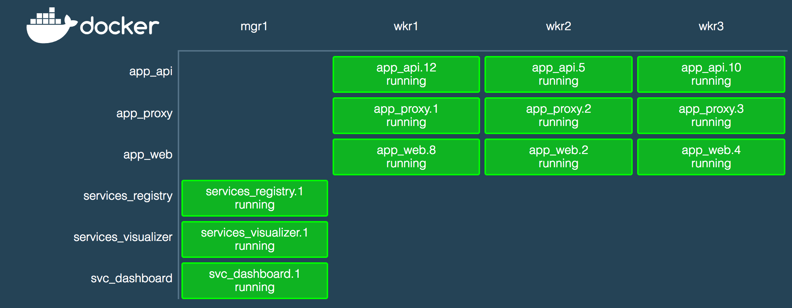

# Swarm Dashboard

A simple monitoring dashboard for Docker in Swarm Mode.

## About

Swarm dashboard shows you all the tasks running on a Docker Swarm organised
by service and node. It provides a visualisation that's space efficient
and works well at a glance.

You can use it as a simple live dashboard of the state of your Swarm.

The Dashboard has a node.js server which streams swarm updates to an Elm client
over a websocket.

### Prior art

* Heavily inspired by [Docker Swarm Visualiser](https://github.com/dockersamples/docker-swarm-visualizer)

## Running

> TODO finish when an initial version is tagged and published to Docker Hub

## Rough roadmap

* Show as many task states as makes sense (see [the task model proposal](https://github.com/docker/swarmkit/blob/master/design/task_model.md#task-lifecycle))
* Show node details (role, state and availability, resources, ...)
* Show more service details (published port, image name and version)
* Show overlay networks
* Node / Service /Task details panel

Both feature requests and pull requests are welcome
