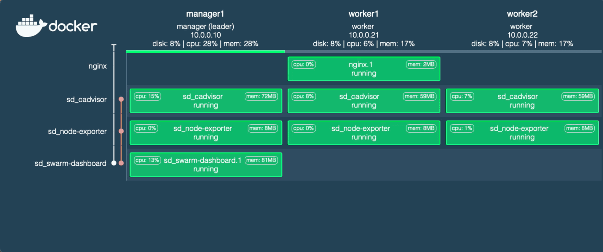

# Swarm Dashboard

A simple monitoring dashboard for Docker in Swarm Mode.



Swarm Dashboard shows you all the tasks running on a Docker Swarm organized
by service and node. It provides a space-efficient visualization
and works well at a glance. You can use it as a simple live dashboard of the state of your Swarm.

It also shows the CPU/Memory/Disk usage of your swarm node and containers.

## Usage

The dashboard needs to be deployed on one of the swarm managers.
You can configure it with the following Docker compose file:

```yml
# compose.yml
version: "3"

services:
  swarm-dashboard:
    image: mohsenasm/swarm-dashboard:dev_stats
    volumes:
      - /var/run/docker.sock:/var/run/docker.sock
    ports:
      - 8080:8080
    environment:
      PORT: 8080
      ENABLE_AUTHENTICATION: "false"
      ENABLE_HTTPS: "false"
      NODE_EXPORTER_SERVICE_NAME_REGEX: "node-exporter"
      CADVISOR_SERVICE_NAME_REGEX: "cadvisor"
    deploy:
      placement:
        constraints:
          - node.role == manager
  
  node-exporter:
    image: quay.io/prometheus/node-exporter:v1.6.1
    volumes:
      - '/:/host:ro'
    command:
      - '--path.rootfs=/host'
    deploy:
      mode: global

  cadvisor:
    image: gcr.io/cadvisor/cadvisor
    volumes:
      - /:/rootfs:ro
      - /var/run:/var/run:rw
      - /sys:/sys:ro
      - /var/lib/docker/:/var/lib/docker:ro
      - /dev/disk/:/dev/disk:ro
    deploy:
      mode: global
```

and deploy with

```
$ docker stack deploy -c compose.yml sd
```

Note that the usage of `node-exporter` and `cadvisor` are optional, to fetch node CPU/Memory/Disk usage and containers' CPU/Memory usage respectively. If you don't need this feature, make sure to remove `NODE_EXPORTER_SERVICE_NAME_REGEX` and `CADVISOR_SERVICE_NAME_REGEX` envs.

## Advance Usage

List of environment variables for more customization:

| Enviroment Varibles                  | Example                                                                                                           | Considration                                                                                                                                                                     |
|--------------------------------------|-------------------------------------------------------------------------------------------------------------------|----------------------------------------------------------------------------------------------------------------------------------------------------------------------------------|
| PORT                                 | 8080                                                                                                              | HTTP / HTTPS port                                                                                                                                                                |
| ENABLE_AUTHENTICATION                | true                                                                                                              | false by default                                                                                                                                                                 |
| AUTHENTICATION_REALM                 | MyRealm                                                                                                           | Use this env if ENABLE_AUTHENTICATION is `true`.                                                                                                                                 |
| USERNAME                             | admin                                                                                                             | Use this env if ENABLE_AUTHENTICATION is `true`.                                                                                                                                 |
| PASSWORD                             | supersecret                                                                                                       | Use this env if ENABLE_AUTHENTICATION is `true`.                                                                                                                                 |
| ENABLE_HTTPS                         | true                                                                                                              | false by default                                                                                                                                                                 |
| LEGO_PATH                            |                                                                                                                   | Use this env if ENABLE_HTTPS is `true`. Lego is used to create the SSL certificates. Create a named volume for this path to avoid the creation of a new certificate on each run. |
| HTTPS_HOSTNAME                       | swarm-dashboard.example.com                                                                                       | Use this env if ENABLE_HTTPS is `true`.                                                                                                                                          |
| LEGO_NEW_COMMAND_ARGS                | --accept-tos --email=you@swarm-dashboard.example.com --domains=swarm-dashboard.example.com --dns cloudflare run   | Use this env if ENABLE_HTTPS is `true`.                                                                                                                                          |
| LEGO_RENEW_COMMAND_ARGS              | --accept-tos --email=you@swarm-dashboard.example.com --domains=swarm-dashboard.example.com --dns cloudflare renew | Use this env if ENABLE_HTTPS is `true`.                                                                                                                                          |
| CLOUDFLARE_EMAIL                     | you@example.com                                                                                                   | You can use any DNS provider that Lego supports.                                                                                                                                 |
| CLOUDFLARE_API_KEY                   | yourprivatecloudflareapikey                                                                                       | You can use any DNS provider that Lego supports.                                                                                                                                 |
| DOCKER_UPDATE_INTERVAL               | 1000                                                                                                              | Refresh interval in ms.                                                                                                                                                          |
| METRICS_UPDATE_INTERVAL              | 5000                                                                                                              | Refresh interval in ms.                                                                                                                                                          |
| NODE_EXPORTER_SERVICE_NAME_REGEX     | node-exporter                                                                                                     | Use this env to enable `node-exporter` integration.                                                                                                                               |
| NODE_EXPORTER_INTERESTED_MOUNT_POINT |                                                                                                                   | You may need this config if you have not specified `--path.rootfs=/host` for `node-exporter`.                                                                                     |
| NODE_EXPORTER_PORT                   | 9100                                                                                                              |                                                                                                                                                                                  |
| CADVISOR_SERVICE_NAME_REGEX          | cadvisor                                                                                                          | Use this env to enable `cadvisor` integration.                                                                                                                                    |
| CADVISOR_PORT                        | 8080                                                                                                              |                                                                                                                                                                                  |


## Security

+ We redact docker event data before sending them to the client. The previous version was sending the whole docker event data, including environment variables (someone might have stored some passwords in them, by mistake!). So, please consider using the newer version.

+ Using the `ENABLE_AUTHENTICATION` environment variable, there is an option to use `Basic Auth`. The WebSocket server will close the connection if it does not receive a valid authentication token. See the example in the above section for more info.

+ Using the `ENABLE_HTTPS` environment variable, there is an option to use `HTTPS` and `WSS`. We have Let’s Encrypt integration with the DNS challenge. See the example in the above section for more info.


## Production use

There are two considerations for any serious deployment of the dashboard:

1. Security - the dashboard node.js server has access to the docker daemon unix socket
   and runs on the manager, which makes it a significant attack surface (i.e. compromising
   the dashboard's node server would give an attacker full control of the swarm)
1. The interaction with docker API is a fairly rough implementation and
   is not very optimized. The server polls the API every 500 ms, publishing the
   response data to all open WebSockets if it changed since last time. There
   is probably a better way to look for changes in the Swarm that could be used
   in the future.


## Rough roadmap

* Show more service details (published port, image name, and version)
* Node / Service / Task details panel

Both feature requests and pull requests are welcome.

### Prior art

* Heavily inspired by [Docker Swarm Visualiser](https://github.com/dockersamples/docker-swarm-visualizer)

## Contributors

* Mohammad-Mohsen Aseman-Manzar (current maintainer) - code, docs
* Viktor Charypar (previous repo owner) - code, docs
* Clementine Brown - design
